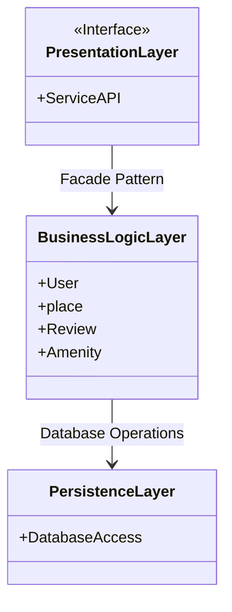

## introduction

This document provides an in-depth overview of the architecture and design for the HBB project. It brings together essential diagrams, including system architecture, class structures, and API interaction workflows, accompanied by detailed notes that explain the different components and how they interact. The goal of this document is to serve as a clear reference for developers and stakeholders during the development stages, ensuring a unified and well-organized approach to constructing the HBB application.

### High-Level Package Diagram

