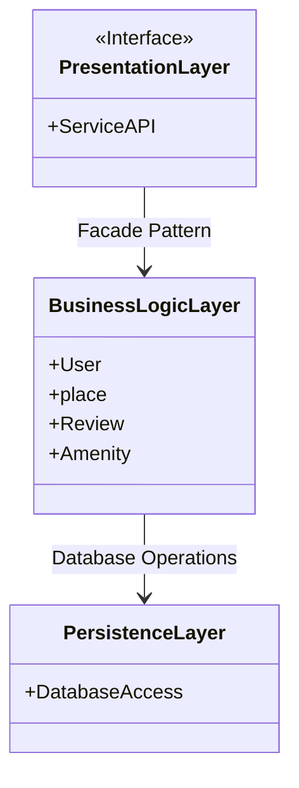
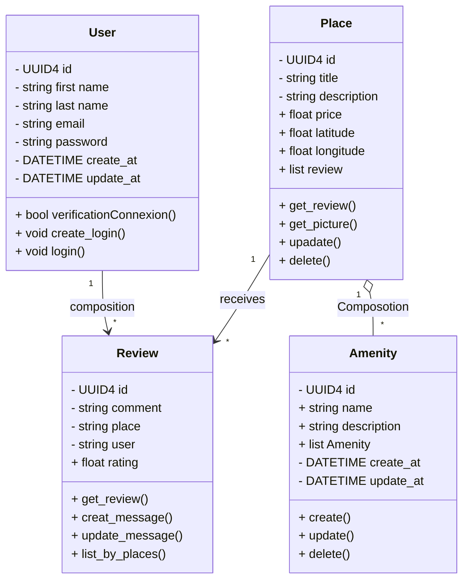
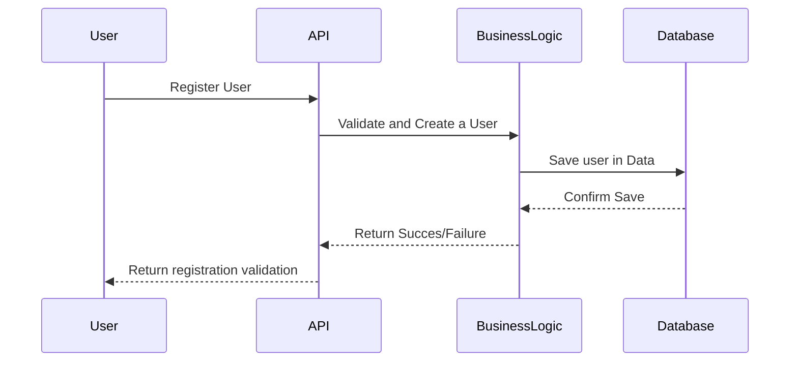
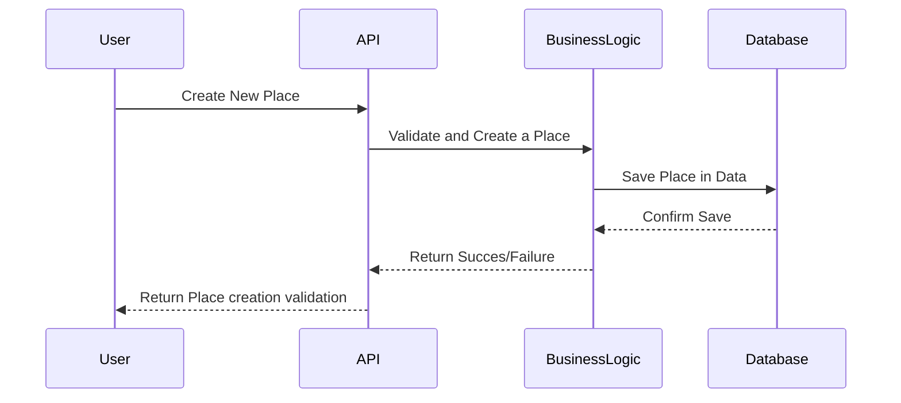
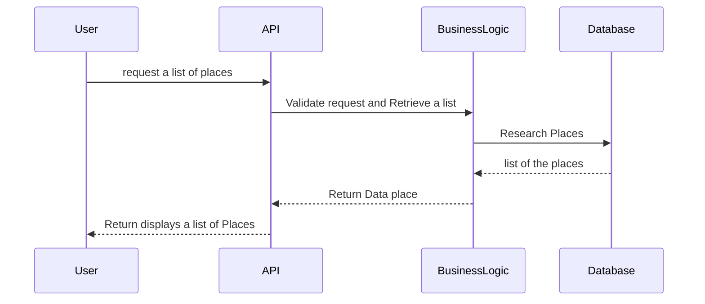

# UML HBNB

## introduction

This document provides an in-depth overview of the architecture and design for the HBB project. It brings together essential diagrams, including system architecture, class structures, and API interaction workflows, accompanied by detailed notes that explain the different components and how they interact. The goal of this document is to serve as a clear reference for developers and stakeholders during the development stages, ensuring a unified and well-organized approach to constructing the HBB application.

### High-Level Package Diagram

### Class Diagram Overview

The class diagram illustrates the three-layer architecture of the HBB project:

1- Presentation Layer:

Exposes the ServiceAPI and interacts with the Business Logic Layer via the Facade Pattern, providing a simple interface for users or external services.

2- Business Logic Layer:

Contains key entities such as User, Place, Review, and Amenity. It handles core application logic and communicates with the Persistence Layer for database operations.

3- Persistence Layer:

Manages database access through the DatabaseAccess class, ensuring data transactions are isolated from business logic.

The Facade Pattern and clear separation between layers promote maintainability and simplicity in the system’s design.

# Detailed Class Diagram

### Detailed Class Diagram overview

User: Manages user data and handles login/verification. Users can write multiple reviews.

Review: Represents reviews with comments, ratings, and associated places.

Place: Describes a location, manages reviews, and links to amenities.

Amenity: Defines features of a place, with methods to create, update, and delete.

Relationships:

User → Review (composition).
Place → Review (receives) and Place → Amenity (composition).

# Sequence Diagrams for API Calls

User Registration:

The User sends a registration request to the API.
The API forwards the request to the Business Logic layer to validate and create the user.
The Business Logic then saves the user data in the Database.
Upon confirmation from the Database, the Business Logic returns a success or failure response to the API.
Finally, the API responds to the User with the registration validation outcome.

Create New Place:

The User initiates a request to create a new place via the API.
The API sends the request to the Business Logic, which validates and creates the place.
The place data is saved in the Database.
After receiving a confirmation, the Business Logic informs the API of the result.
The API then returns the creation validation to the User.

Request List of Places:

The User requests a list of places through the API.
The API communicates with the Business Logic to validate the request and retrieve the list.
The Business Logic queries the Database for the places.
After fetching the data, the Database sends the list back to the Business Logic.
The Business Logic returns the place data to the API, which then displays the list to the User.

# Conclusion

The sequence diagrams presented in this document outline the critical interactions between the User, API, Business Logic, and Database within the HBB project. Each operation, from user registration to creating new places and retrieving lists, illustrates a structured flow of data and validation, ensuring a seamless user experience. By clearly defining these interactions, we promote a robust architecture that supports maintainability, scalability, and ease of integration for future enhancements. This foundational design serves as a roadmap for developers and stakeholders, guiding the implementation of features in the HBB application.

